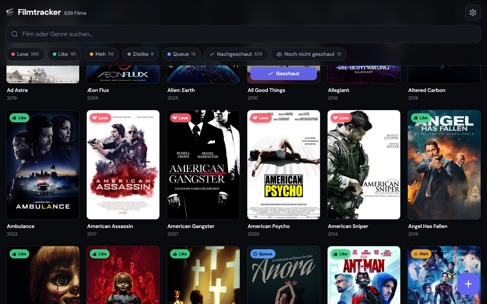

# 🎬 Filmtracker (Public)

**Die meisten führen ihre Filme in einer Excel-Liste oder gar nicht. Filmtracker ist eine öffentliche Film-Datenbank mit eigenem Konto — Filme per TMDb-Suche hinzufügen, bewerten, filtern, durchsuchen. Jede Bibliothek ist privat.**
_Most people track the films they've seen in a spreadsheet, or not at all. Filmtracker is a public movie database with your own account — add films via TMDb search, rate, filter, search. Every library is private._



**Live: [filmtracker-public.questside.workers.dev](https://filmtracker-public.questside.workers.dev)**

---

## 🇩🇪 Deutsch

### Das Problem
Wer seine gesehenen Filme festhalten will, landet meist bei einer Excel-Liste: Titel raussuchen, Genre und Jahr von Hand eintragen, kein Poster, nichts vernünftig durchsuchbar — und auf dem Handy unbrauchbar.

### Die Lösung
Die öffentliche Multi-User-Version meines [privaten Filmtrackers](https://github.com/usr1243/filmtracker). Jeder kann sich mit Username + Passwort registrieren und bekommt eine eigene, isolierte Filmbibliothek — Bewertung (Love/Like/Meh/Dislike/Queue), Status, Listen, TMDb-Suche zum Hinzufügen und KI-gestützter Text-Import (Groq extrahiert Titel aus reingepastetem Text).

### Warum ein selbst gebautes Login?
Der private Filmtracker hatte bewusst kein Login (Single-User-Tool). Für die öffentliche Demo brauchte es echte Trennung zwischen Nutzern, ohne einen kompletten Auth-Anbieter wie Supabase/Auth0 reinzuziehen — also selbst gebaut, mit den Bordmitteln der Cloudflare-Workers-Runtime.

### Wie funktioniert das Login?
- **Passwort-Hashing:** PBKDF2-SHA256, 100.000 Iterationen, per-User-Salt — über die Web Crypto API (`crypto.subtle`), da die Workers-Runtime kein Node.js ist und `bcrypt`/`argon2` dort nicht läuft.
- **Session:** signiertes, zustandsloses HttpOnly-Cookie (HMAC-SHA256), 30 Tage gültig — kein Session-Store nötig, jeder Request verifiziert sich selbst.
- **Schutzmaßnahmen:** konstante-Zeit-Vergleich gegen Timing-Angriffe, Dummy-Hash-Vergleich bei unbekanntem Username (verrät nicht, ob ein Account existiert), identische Fehlermeldung bei falschem Passwort vs. unbekanntem Account, KV-basiertes Rate-Limiting gegen Brute-Force (5 Fehlversuche/15 Min pro Account+IP).
- **Bewusst kein Passwort-Reset per Email:** würde einen externen Mail-Dienst (Resend o.ä.) mit verifizierter Domain voraussetzen — für dieses Demo-Projekt nicht im Verhältnis. Passwort vergessen → neuer Account.

### Wie funktioniert es sonst?
- **Frontend:** Single-File-Web-App (Vanilla JS), kein Framework.
- **Backend:** ein Cloudflare Worker, flache Route-Struktur.
- **Speicher:** Cloudflare KV, pro Account ein eigener Key (`state:<username>`) — keine gemeinsame Datenbank-Tabelle, echte Isolation auf Key-Ebene.
- **Anreicherung:** TMDb-API für Poster/Genre/Beschreibung, mehrstufiger Titel-Abgleich gegen Remakes und Lokalisierungs-Varianten.
- **KI-Import:** Groq (`openai/gpt-oss-120b`) extrahiert Filmtitel aus Freitext, danach übernimmt derselbe TMDb-Abgleich wie bei der manuellen Suche.

## 🇬🇧 English

### The problem
If you want to keep track of the films you've seen, you usually end up with a spreadsheet: looking up titles, typing in genre and year by hand, no poster, nothing properly searchable — and useless on a phone.

### The solution
The public multi-user version of my [private Filmtracker](https://github.com/usr1243/filmtracker). Anyone can register with a username and password and gets their own, fully isolated movie library — ratings, watch status, custom lists, TMDb search-to-add, and AI-powered text import (Groq extracts titles from pasted text).

### Why a self-built login?
The private Filmtracker deliberately had no login (single-user tool). The public demo needed real separation between users without pulling in a full auth provider like Supabase/Auth0 — so I built it myself using what the Cloudflare Workers runtime already offers.

### How does the login work?
- **Password hashing:** PBKDF2-SHA256, 100,000 iterations, per-user salt — via the Web Crypto API (`crypto.subtle`), since the Workers runtime isn't Node.js and `bcrypt`/`argon2` won't run there.
- **Session:** a signed, stateless HttpOnly cookie (HMAC-SHA256), valid 30 days — no session store needed, every request verifies itself.
- **Protections:** constant-time comparison against timing attacks, a dummy-hash comparison for unknown usernames (doesn't leak whether an account exists), identical error message for wrong password vs. unknown account, KV-backed rate limiting against brute force (5 failed attempts/15 min per account+IP).
- **Deliberately no email password reset:** would require an external email provider (Resend or similar) with a verified domain — not worth it for a demo project. Forgot your password → create a new account.

### How does the rest work?
- **Frontend:** single-file web app (vanilla JS), no framework.
- **Backend:** one Cloudflare Worker, flat route structure.
- **Storage:** Cloudflare KV, one key per account (`state:<username>`) — no shared database table, real isolation at the key level.
- **Enrichment:** TMDb API for poster/genre/description, multi-stage title matching to handle remakes and localized titles.
- **AI import:** Groq (`openai/gpt-oss-120b`) extracts movie titles from pasted text, then the same TMDb matching used for manual search takes over.

---

## Tech
`Cloudflare Workers` · `Cloudflare KV` · `Web Crypto API` · `Vanilla JS` · `TMDb API` · `Groq API`

## Lokale Entwicklung / Local dev
```bash
cp .dev.vars.example .dev.vars   # Secrets eintragen / fill in secrets
npx wrangler dev                 # lokal starten / run locally
npx wrangler kv namespace create FILM_STATE   # eigene KV-Namespace / your own KV namespace
npx wrangler deploy              # deployen (eigener Cloudflare-Account) / deploy
```
Secrets werden als Cloudflare-Secrets gesetzt, nie im Code: `npx wrangler secret put SESSION_SECRET` (z. B. `openssl rand -base64 32`), `TMDB_KEY`, `GROQ_API_KEY`.
